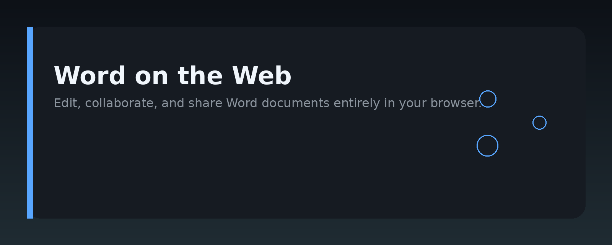
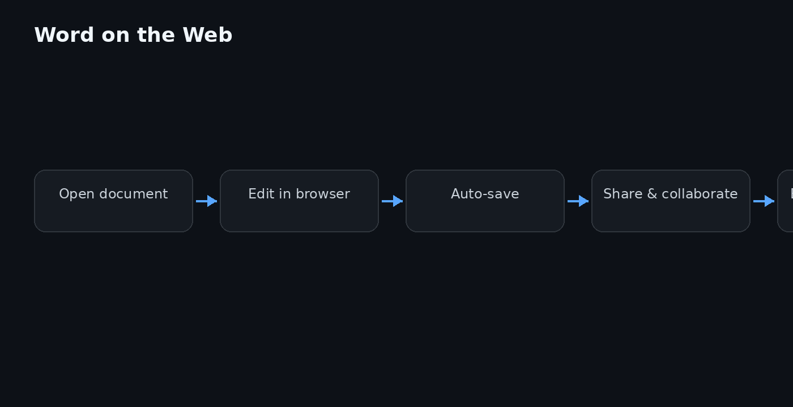

# Microsoft Word Web Editing Guide




## Overview

This handbook is a practical reference for editing documents in Microsoft Word on the web. It covers the browser-based Word editor, its feature set, and how it differs from the desktop application. Whether you are collaborating with a team, working from a shared device, or simply prefer a browser workflow, this guide walks through the essentials of Word online editing.

The content targets everyday tasks: formatting text, inserting media, tracking changes, sharing documents, and handling version history. It also explains the limitations of the web editor so you know when to switch to the desktop app.

## Why it exists

Word on the web is not a full clone of the desktop version. Many users run into confusion when features behave differently or are missing entirely. This repository exists to close that gap with clear, tested instructions.

The guide is useful for:

- Teams that rely on browser-based document editing for remote collaboration.
- Users who need a quick reference for Word web shortcuts and workflows.
- Administrators or trainers creating onboarding material for non-technical staff.
- Anyone evaluating whether the web editor meets their editing needs.

No affiliation with Microsoft is claimed. The information is gathered from public documentation and hands-on testing.

## Core concepts

### Document storage

Word on the web works with files stored in OneDrive, SharePoint, or a local device via upload. Documents opened from cloud storage sync automatically and support real-time co-authoring.

### Co-authoring

Multiple people can edit the same document simultaneously. Changes appear live, and presence indicators show who is working where. Conflicts are rare because Word merges edits at the paragraph level.

### Autosave

Web documents autosave continuously. There is no manual save button in the normal sense; the file is written back to its cloud location as you type.

### Version history

Every autosave creates a version entry. You can review previous states, restore an older copy, or compare changes over time.

### Feature parity

The web editor includes most formatting, layout, and review tools. Advanced features like mail merge, some macros, and complex cross-references are not available in the browser.

## Architecture


The diagram above shows the high-level flow of a Word web session.

- **Browser client**: The editor UI runs in the browser, rendering the document and handling user input.
- **Collaboration service**: Manages presence, change tracking, and merge operations.
- **Document store**: The source of truth, typically OneDrive or SharePoint.
- **Sync engine**: Pushes local edits to the store and pulls remote changes.

The client communicates with the collaboration service over a persistent connection. The document content itself is stored server-side; the browser only holds the currently visible portion.

## Practical workflow

### Opening a document

1. Go to [office.com](https://www.office.com) and sign in.
2. Select **Word** from the app launcher.
3. Choose a recent document or upload a new file.
4. The document opens in the browser editor.

### Editing basics

- Use the ribbon at the top for formatting.
- Right-click for context menus.
- Keyboard shortcuts largely match the desktop version (Ctrl+B, Ctrl+I, Ctrl+U, etc.).

### Sharing a document

1. Click **Share** in the top-right corner.
2. Enter email addresses or copy a link.
3. Set permissions: **Can view** or **Can edit**.
4. Send the invitation.

### Tracking changes

1. Go to the **Review** tab.
2. Click **Track Changes** to enable it.
3. Edits are marked with colored underlines and margin notes.
4. Review and accept or reject each change.

### Restoring a version

1. Open the document.
2. Click the file name at the top.
3. Select **Version History**.
4. Choose a version and click **Restore**.

## Examples

### Enabling co-authoring

```text
1. Upload the document to OneDrive.
2. Open it in Word on the web.
3. Share the link with edit permission.
4. All editors see live changes.
```

### Adding a comment

```text
1. Select the text you want to comment on.
2. Click the comment icon in the toolbar.
3. Type your note.
4. Press Enter to post it.
```

### Converting a web document to desktop format

```text
1. Open the document in Word on the web.
2. Click File > Save As.
3. Choose "Download a copy".
4. Select .docx format.
5. The file downloads to your device.
```

### Checking document statistics

```text
1. Click Review > Word Count.
2. View words, characters, paragraphs, and pages.
3. The count updates as you edit.
```

## FAQ

**Is Word on the web free?**

Yes, a Microsoft account gives you access to Word on the web with core editing features. A Microsoft 365 subscription unlocks additional storage and desktop app access.

**Can I work offline?**

No. The web editor requires a connection. For offline work, use the desktop version and sync later.

**Are all desktop features available?**

Most are, but some advanced tools are missing. Macros, mail merge, and certain referencing features are not present in the browser.

**How do I handle large documents?**

Very large files may load slowly. Consider splitting them or using the desktop app for heavy editing.

**Does co-authoring work with the desktop app?**

Yes, desktop and web users can edit the same document simultaneously as long as it is stored in a cloud location.

**What browsers are supported?**

Current versions of Edge, Chrome, Firefox, and Safari work with Word on the web.

## License MIT

This project is licensed under the MIT License. You are free to use, modify, and distribute the content with attribution. See the [LICENSE](LICENSE) file for details.

Topic: `word-web-editing-kit`
